# EDA & Hypothesis Testing Projects
*Short &amp; fun projects doing EDA on different datasets*

## ___________________________________________________________________________________

[Human Temperature Analysis](https://github.com/Colley-K/eda_projects/blob/master/EDA_avg_human_temp.ipynb)

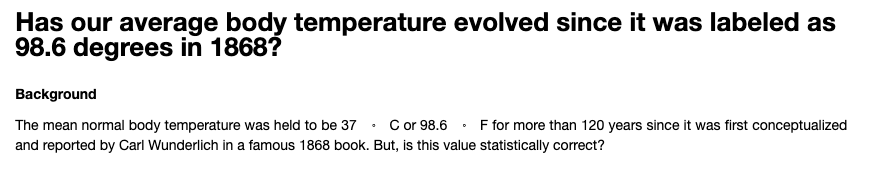
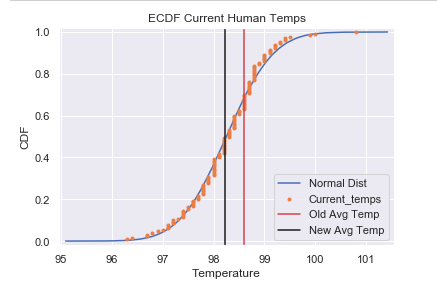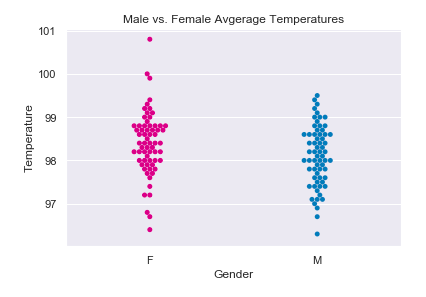
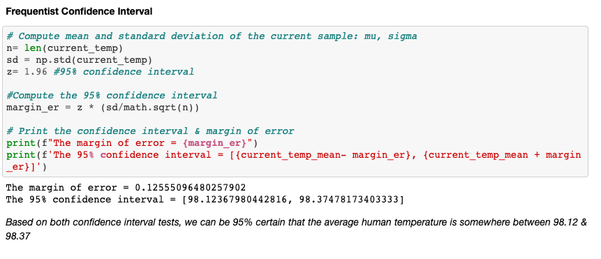
## ___________________________________________________________________________________

[Analyzing Height in Climbing Ability](https://github.com/Colley-K/eda_projects/blob/master/are_taller_people_climbing_harder_grades%3F.ipynb)

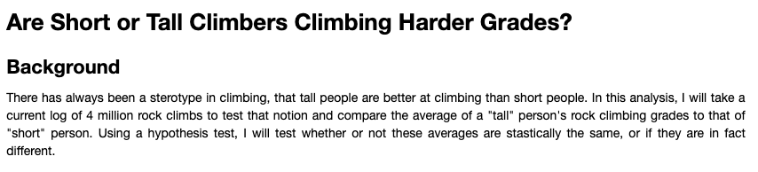
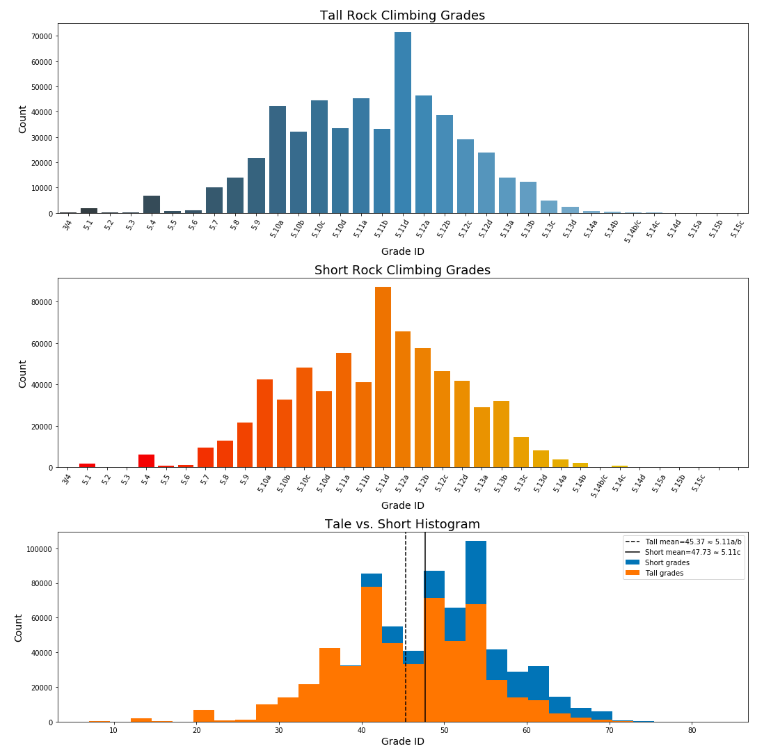
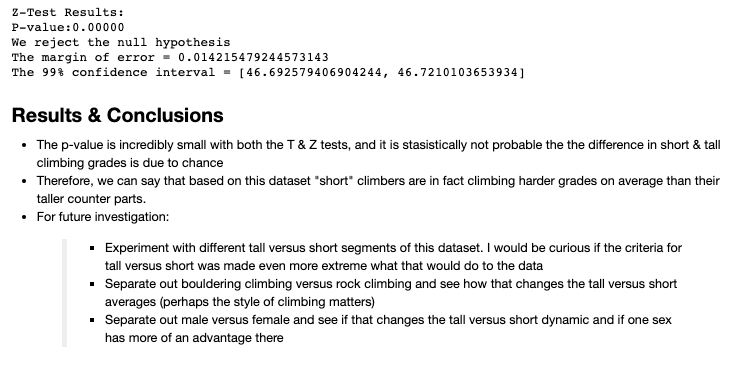
## ___________________________________________________________________________________

[Analyzing Racism in Job Applications](https://github.com/Colley-K/eda_projects/blob/master/EDA_racism_in_job_searches.ipynb)

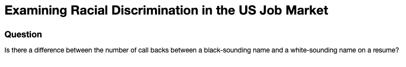
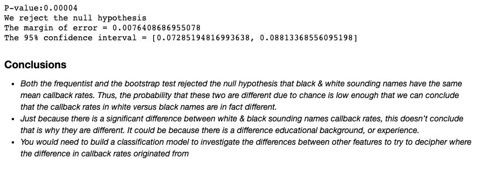

## ___________________________________________________________________________________

[Analyzing Hospital Readmission Rates](https://github.com/Colley-K/eda_projects/blob/master/hospital_readmit_reanalysis.ipynb)

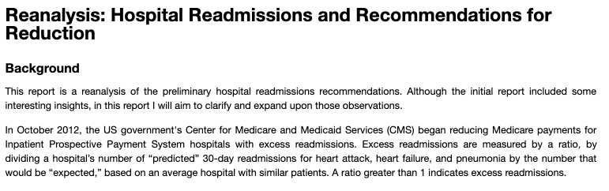
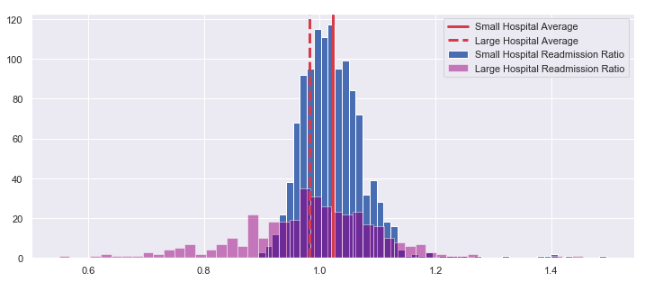

